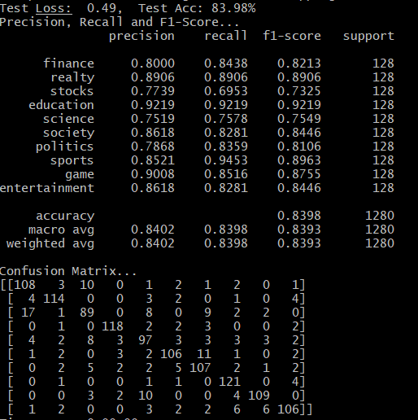
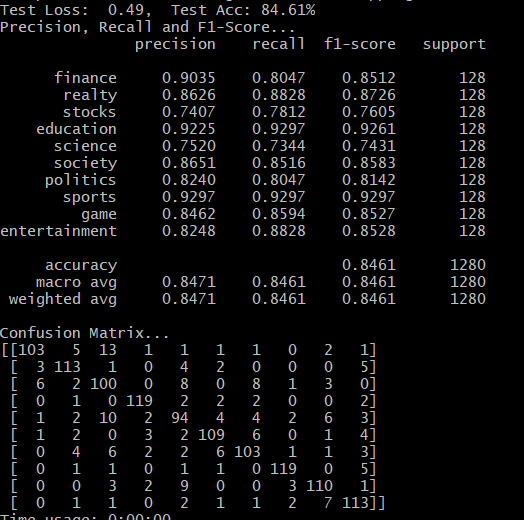
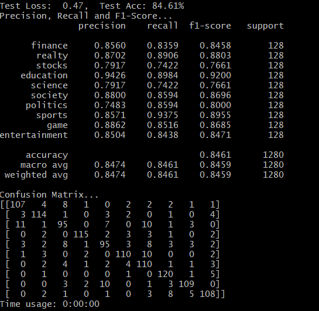

# 对抗训练实验报告
基于中文文本分类TextCNN方法，将图像领域的对抗训练技术应用到文本分类任务中。

数据以字为单位输入模型，预训练词向量使用 [搜狗新闻 Word+Character 300d](https://github.com/Embedding/Chinese-Word-Vectors)，[点这里下载](https://pan.baidu.com/s/14k-9jsspp43ZhMxqPmsWMQ)

## 环境
python 3.7
pytorch 1.1
tqdm
sklearn
tensorboardX

## 中文数据集
[THUCNews](http://thuctc.thunlp.org/)
数据集划分：

数据集|数据量（机器限制，条件允许可使用更大数据集实验）
--|--
训练集|12800
验证集|1280
测试集|1280

## 关键代码
### 选择对抗方式
```
    def train_against(against, model, trains, labels):
        if against == "fgm":
            fgm_against(model, trains, labels)
        elif against == "pgd":
            pgd_against(model, trains, labels)
        elif against == "freeAT":
            freeAT_against(model, trains, labels)
```
        
### 进行对抗训练
#### FGM
```
    def fgm_against(model, trains, labels):
        fgm = FGM(model)
        fgm.attack(1, "embedding.weight")  # 在embedding上添加对抗扰动
        outputs = model(trains)
        loss_adv = F.cross_entropy(outputs, labels)
        loss_adv.backward()  # 反向传播，并在正常的grad基础上，累加对抗训练的梯度
        fgm.restore("embedding.weight")  # 恢复embedding参数
```

#### PGD
```
    def pgd_against(model, trains, labels):
        pgd = PGD(model)
        K = 3
        # 对抗训练
        pgd.backup_grad()
        for t in range(K):
            pgd.attack(is_first_attack=(t == 0), emb_name="embedding.weight")  # 在embedding上添加对抗扰动, first attack时备份param.data
            if t != K - 1:
                model.zero_grad()
            else:
                pgd.restore_grad()
            outputs = model(trains)
            loss_adv = F.cross_entropy(outputs, labels)
            loss_adv.backward()  # 反向传播，并在正常的grad基础上，累加对抗训练的梯度
        pgd.restore(emb_name="embedding.weight")  # 恢复embedding参数
```

#### FreeAT
```
    def freeAT_against(model, trains, labels):
        free = FreeAT(model)
        r = 0
        m_repeat = 2
        for _ in range(m_repeat):
            # embedding扰动，并更新r值
            r = free.attack(r, 1, "embedding.weight")  # 在embedding上添加对抗扰动
            # print('r = ', r)
            outputs = model(trains)
            loss_adv = F.cross_entropy(outputs, labels)
            loss_adv.backward()  # 反向传播，并在正常的grad基础上，累加对抗训练的梯度
        free.restore("embedding.weight")  # 恢复embedding参数
```

### 对抗模型  
#### FGM  
```
    class FGM():
        def __init__(self, model):
            self.model = model
            self.backup = {}
        
        def attack(self, epsilon=1., emb_name='emb.'):
            # emb_name这个参数要换成你模型中embedding的参数名
            for name, param in self.model.named_parameters():
                if param.requires_grad and emb_name in name:
                    self.backup[name] = param.data.clone()
                    norm = torch.norm(param.grad)
                    if norm != 0 and not torch.isnan(norm):
                        r_at = epsilon * param.grad / norm
                        param.data.add_(r_at)

        def restore(self, emb_name='emb.'):
            # emb_name这个参数要换成你模型中embedding的参数名
            for name, param in self.model.named_parameters():
                if param.requires_grad and emb_name in name:
                    assert name in self.backup
                    param.data = self.backup[name]
            self.backup = {}
```
#### PGD  
```
    class PGD():
        def __init__(self, model):
            self.model = model
            self.emb_backup = {}
            self.grad_backup = {}
    
        def attack(self, epsilon=1., alpha=0.3, emb_name='emb.', is_first_attack=False):
            # emb_name这个参数要换成你模型中embedding的参数名
            for name, param in self.model.named_parameters():
                if param.requires_grad and emb_name in name:
                    if is_first_attack:
                        self.emb_backup[name] = param.data.clone()
                    norm = torch.norm(param.grad)
                    if norm != 0 and not torch.isnan(norm):
                        r_at = alpha * param.grad / norm
                        param.data.add_(r_at)
                        param.data = self.project(name, param.data, epsilon)
    
        def restore(self, emb_name='emb.'):
            # emb_name这个参数要换成你模型中embedding的参数名
            for name, param in self.model.named_parameters():
                if param.requires_grad and emb_name in name:
                    assert name in self.emb_backup
                    param.data = self.emb_backup[name]
            self.emb_backup = {}
    
        def project(self, param_name, param_data, epsilon):
            r = param_data - self.emb_backup[param_name]
            if torch.norm(r) > epsilon:
                r = epsilon * r / torch.norm(r)
            return self.emb_backup[param_name] + r
    
        def backup_grad(self):
            for name, param in self.model.named_parameters():
                if param.requires_grad:
                    # print('name: ', name)
                    self.grad_backup[name] = param.grad.clone()
    
        def restore_grad(self):
            for name, param in self.model.named_parameters():
                if param.requires_grad:
                    param.grad = self.grad_backup[name]
```
#### FreeAT  
```
    class FreeAT():
        def __init__(self, model):
            self.model = model
            self.backup = {}
    
        def attack(self, r, epsilon=1., emb_name='emb.'):
            # emb_name这个参数要换成你模型中embedding的参数名
            for name, param in self.model.named_parameters():
                if param.requires_grad and emb_name in name:
                    # print('param before: ', param)
                    self.backup[name] = param.data.clone()
                    norm = torch.norm(param.grad)
                    if norm != 0 and not torch.isnan(norm):
                        # r_at = epsilon * param.grad / norm
                        # param.data.add_(r_at)
                        r = r + epsilon * param.grad / norm
                        param.data.add_(r)
            return r
    
        def restore(self, emb_name='emb.'):
            # emb_name这个参数要换成你模型中embedding的参数名
            for name, param in self.model.named_parameters():
                if param.requires_grad and emb_name in name:
                    assert name in self.backup
                    param.data = self.backup[name]
            self.backup = {}
```
## 效果
实验过程中，其他实验参数（batch size, learning rate等）均设置相同，
均训练至模型收敛，TextCNN，FGM, PGD, FreeAT效果对比如下：


| 模型 | acc | recall | f1 |
|---|---|---|---|
|TextCNN|0.8398|0.83984|0.83928
|TextCNN + FGM|0.8461|0.8461|0.84612
|TextCNN + PGD|0.8461|0.8461|0.8459
|TextCNN + FreeAT|

- TextCNN



- TextCNN + FGM



- TextCNN + PGD



- TextCNN + freeAT


## 使用说明
```
# 训练并测试：
这里加入不同对抗方法接口
python run.py --model TextCNN --adversarial fgm

# PGD
python run.py --model TextRNN --adversarial pgd

# freeAT
python run.py --model TextRNN --adversarial freeAT
```

## 对应论文
[1] Convolutional Neural Networks for Sentence Classification.

[2] Fast is better than free: Revisiting adversarial training.
